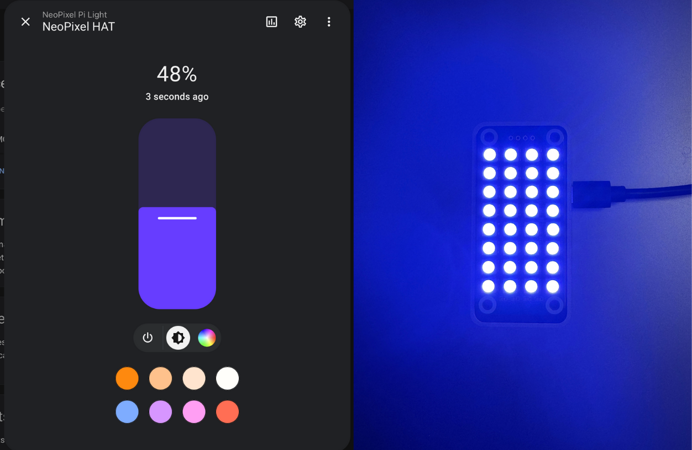

# NeoPixel HAT in Home Assistant

<div align="center">
  
</div>


## Usage
```
git clone https://github.com/EastMarketSideProjects/neopixel-hat.git
cd neopixel-hat
pip install -r requirements.txt
python3 main.py
```
